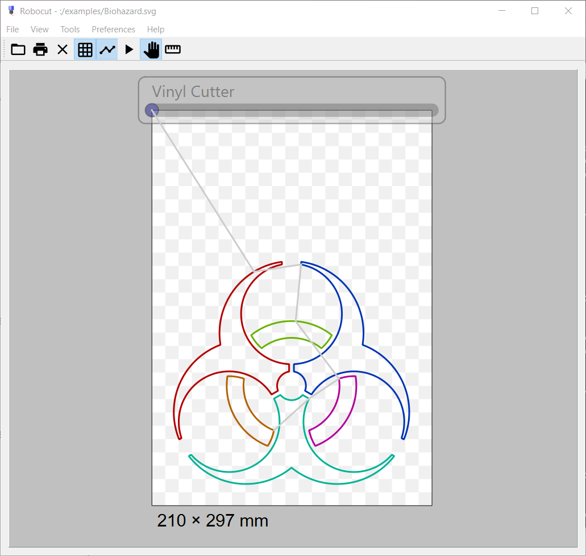
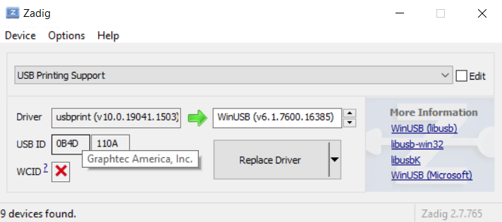

# Robocut

Robocut is a simple graphical program to allow you to cut graphics with one of the following vinyl cutters made by Graphtec:

* Craft Robo CC200-20
* Craft Robo CC300-20
* Silhouette SD
* Silhouette SD 2
* Silhouette Cameo
* Silhouette Cameo 3
* Silhouette Portrait

It can read SVG Tiny 1.2 files ([details](https://doc.qt.io/qt-5.10/svgrendering.html)). This includes files produced by Inkscape. Unlike the official programs, Robocut can also run on Linux and Mac OS X.

One limitation of SVG Tiny is that it does not support `x` and `y` position attributes in `<tspan>` elements. Unfortunately this is how Inkscape does multi-line text, so you must convert multi-line text to paths before export.

## Authors

Originally written by Tim Hutt with big improvements from Markus Schulz, Juergen Weigert and others. The protocol was originally reverse engineered by Tim Hutt. Dave Mankoff later [managed to tease some documentation from Graphtec](https://www.ohthehugemanatee.net/2011/07/gpgl-reference-courtesy-of-graphtec/) but unfortunately it is not very clear.

## Installation Instructions

### Windows

Download the latest Windows binary release, and also [Zadig](http://zadig.akeo.ie/), which is the easiest way to install a libusb-compatible driver for your cutter.

Run Zadig, and use it to install a driver for your device. You may need to check `Options->List all devices` and find the `USB Printing Support` device (if you hover the "Vendor ID" it should say "Graphtec"). Replace its `usbprint` driver with `WinUSB`.

Once that is complete you should just be able to run `Robocut.exe`.

### OSX

This is the easiest option - unzip the application and copy it to your Applications directory. Run it. If you are given a security warning about it being from an unidentified developer, go into your System Setting, then Security, then it should say something about Robocut with an `Open Anyway` button. Click it.

### Linux

There is an old version available for Ubuntu.

	sudo apt-get install robocut

For the latest version you need to build from source. First install the dependencies - Qt6 and libusb-1.0. Then unzip the source and run

	qmake
	make

To install the binary system-wide just do

	sudo cp Robocut /usr/local/bin

Finally *remember to make sure you are in the lp group*:

	adduser <you> lp

You will probably have to log out and log in again after that.

## Usage Instructions

Basic instructions are:

1. Create a new A4 portrait drawing in Inkscape. (For the registration mark feature you can use the supplied public domain letter_reg-marks.svg file)
2. Make sure in the options that the default export DPI is 96.0
3. Paste your stuff into the drawing.
4. Export as Plain SVG.
5. Open the SVG with Robocut.
6. Make sure it will cut correctly with the View->Animate option.
7. File->Cut.

## Troubleshooting

* It doesn't cut my fonts correctly?!

Qt SVG only supports the SVG 1.2 Tiny standard which does not support positioning `<tspan>` elements. This is how Inkscape handles multi-line text. The best solution is to change them to paths (in Inkscape it is `Path->Object to Path`), before exporting the SVG.

* The cutter stops mid-cut.

I'm not sure why this is.

* The whole program crashes.

This is possibly because you opened an SVG containing raster data. It shouldn't happen but it hasn't been fixed yet.

* It says it can't find the cutter or "the operation is not supported".

Make sure the WinUSB driver is installed with Zadig on Windows. On Linux make sure you are in the `lp` group.

## Changelog

2.0.0.beta0

* New welcome UI with example files.
* Background 1cm grid.
* Rule measuring tool (to verify dimensions)
* Option to show the cutter path.
* New path sorting algorithms - Sort by Y may be useful for cutting without a mat in some cases.
* HPGL export. This is not tested with an actual plotter yet but I do have access to one so I will at some point. It also only exports a file, it doesn't support direct writing to a serial port (yet).
* Lots of code updates.

1.0.11

* Windows and OSX binaries released for first time
* Add in-tree libusb for Windows. Not the best practice but it is only two files.
* Added Transform_Silhouette_Cameo() to rotate the plot as SVG onscreen.
  Allow left aligned paper. Cameo has high x-coordinates to the left,
  although the head homes at the left side.
* Added File->Reload (CTRL-L), this saves a lot of clicking and
  scrolling through the file dialogue while adjusting the design.
* Added View->Identify to print the devices seen to stdout. This option is temporarily hidden in the menu
  (via the .ui file) until it does something user-visible.
* Refactored UsbOpen() / UsbInit() from Plotter.cpp:Cut().
* Added to about message and tooltip. Removed debug page dump on stdout;
* robocut.spec added, as used in https://build.opensuse.org/package/show?package=robocut&project=home:jnweiger
* Move all information to Readme.md rather than spreading it out over multiple files.
* Maybe very slightly better icon? It's still pretty rubbish! Contributions welcome!
* Change links to point to http://robocut.org/
* Code style fixes
* Mouse zoom is the "standard" way now.
* Mouse zooms to the cursor.

1.0.10
* Fixed missing image files.

1.0.9
* Add USB ID 111A for CC300-20 Craft Robo Lite as another default.

1.0.8
* changes in Robocut.pro for qmake so no QT files are shipped (Debian requirement)

1.0.7
* Add USB ID 111C as another default.

1.0.6
* Tim fixed drawing bug
* changed from float to int for output to plotter, fixes crash of 2nd
gen plotter model
* changed display pen size to 0
* Tim fixed track enhancing option was inverted.

1.0.5
* adding all the changes needed for Debian
* fixed watch file
* make binary lower case
* removed redundant copyright form the copyright file
* recreated all the images so we have the copyright
* added vcs information to control file
* merged mentor in to master

1.0.4

* add .desktop file for Ubuntu
* default needs to be 10 for pressure
* get menu working
* better sample reg file

1.0.3

* manpage
* command line interface
* mouse wheel  zoom
* change the draw command to move command if the cut is on the outer edge,
kind of clipping (but not in preview)
* dash pattern from path
* sort the different paths to cut faster
* bounding box option to cut inside path first (good for letters)
* registration mark support

1.0.2

* Initial Release on Ubuntu.
* Some brief documentation
* Initial registration mark support
* Load page size from file
* Small UI improvements

0.2 - a3b13ad - Oct 24th 2010

* Initial working version.

# Licence

This project is licensed under the terms of the [GPL v3](https://www.gnu.org/licenses/gpl-3.0.en.html). See the `COPYING` file for more details.

# Alternatives

* https://www.codelv.com/projects/inkcut/

# TODO

## General

* Improve Bezier-to-polyline conversion and make the coarseness user-configurable
* Use a fancy TSPN algorithm for sorting paths
* Render previews etc. in another thread. Though it does seem pretty fast so maybe I won't bother.
* Add rulers.
* Implement a tool to adjust the scale
* Support multiple devices properly. Ideally with hotplug
* Re-enable command line options
* new sorting algorithm to limit backward movements
	to max 20mm, so that we can cut paper and cardboard
	without a mat in many cases.

## Silhouette Cameo

* paint 24mm blocked area in the GUI at the bottom of the paper.
* put the Identify() output in a GUI element (rather than stdout).
* debug this: when the paper was moved with the devices cursor keys,
	"cut" will just home the paper and not cut at all.
